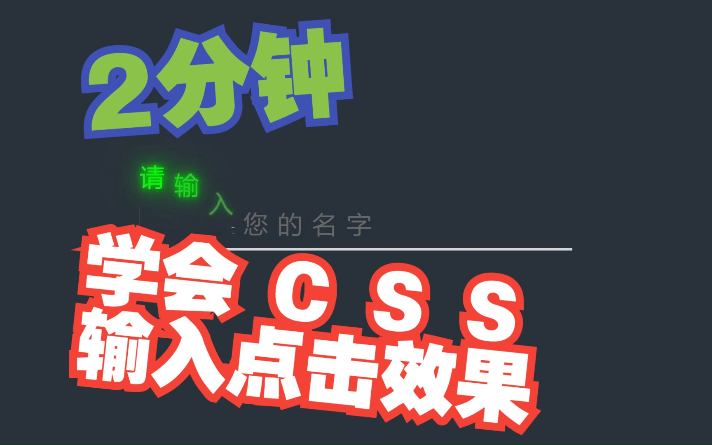
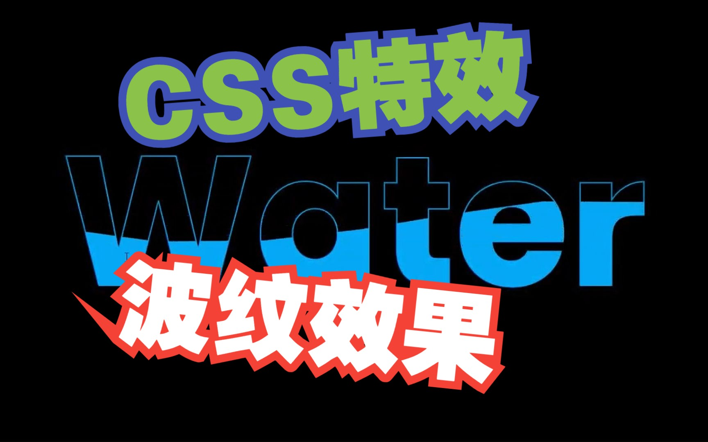
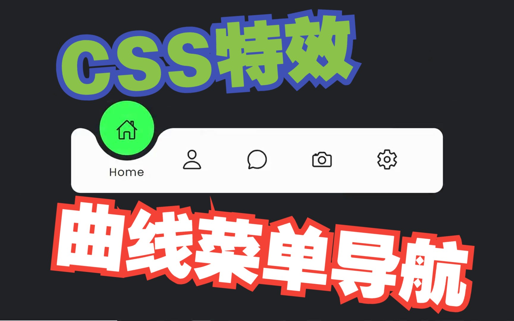
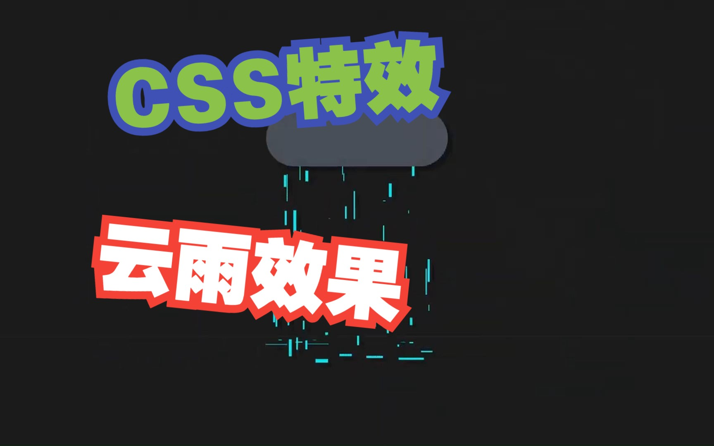
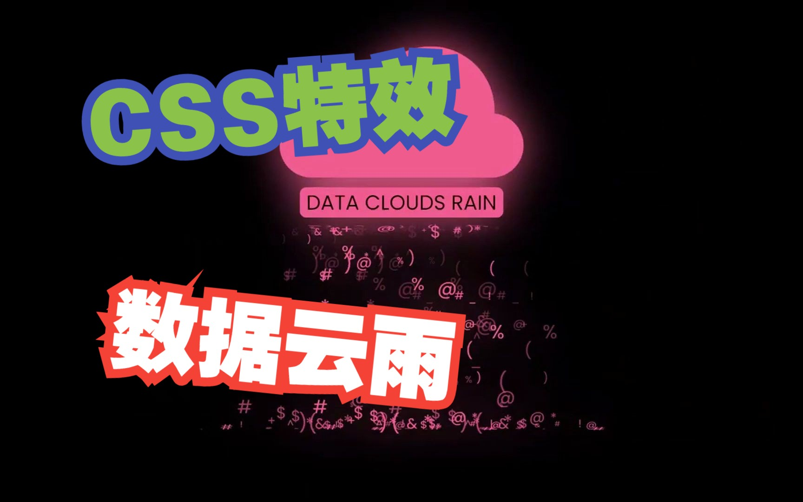
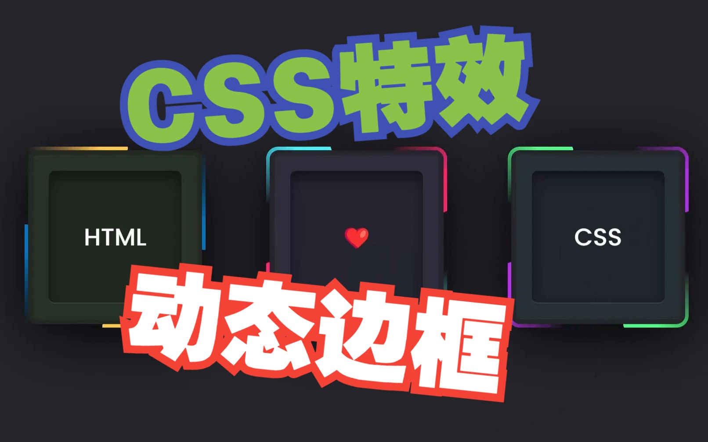
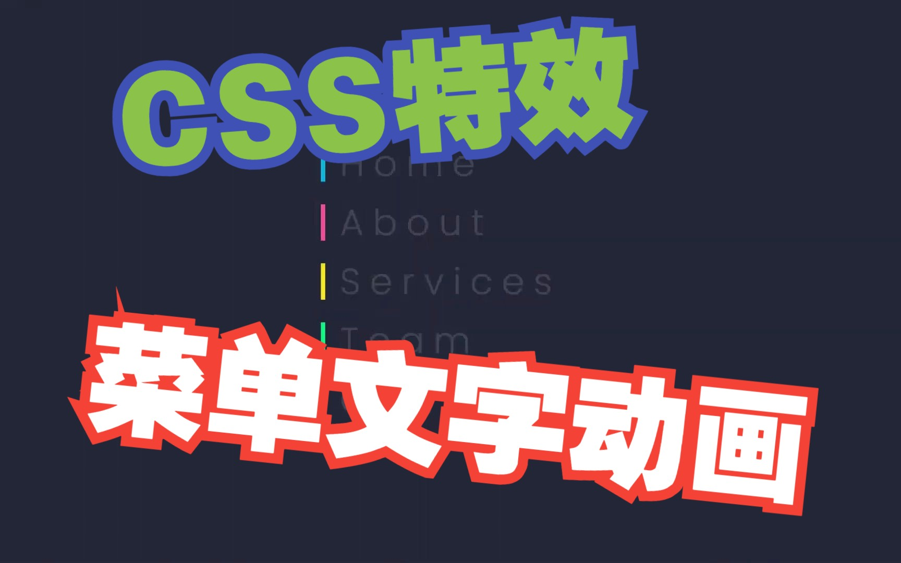
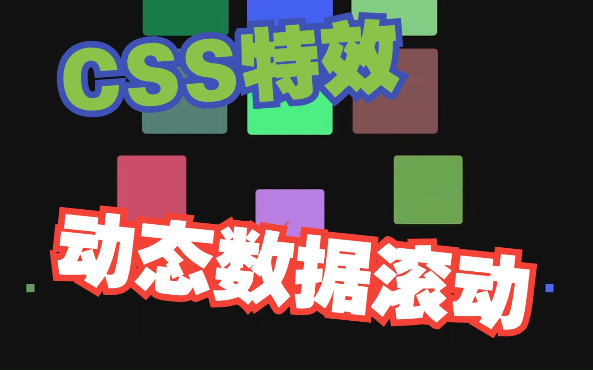
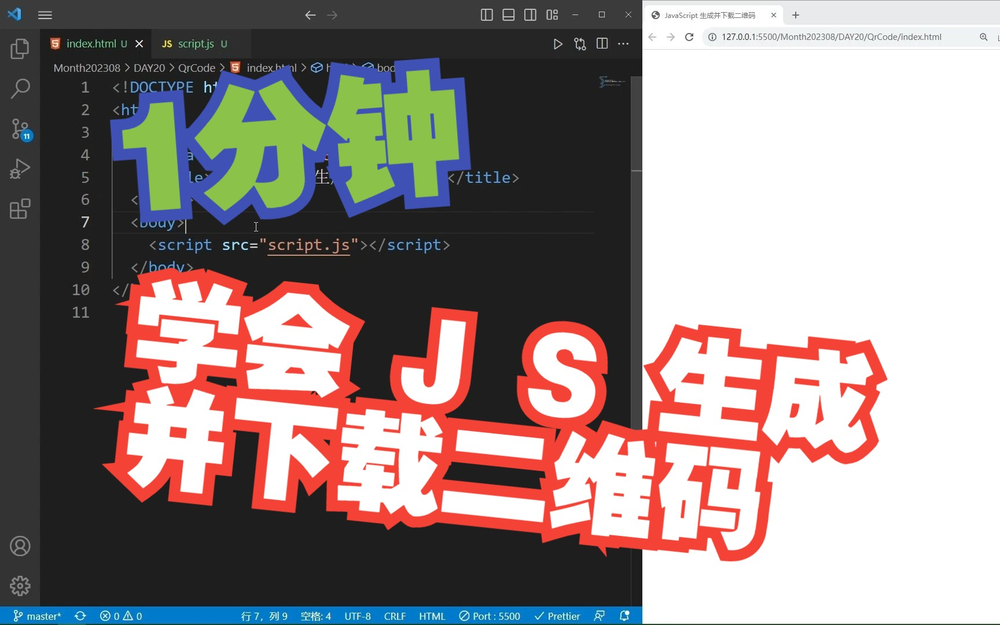

# bilibili-public

## 介绍

b站发布视频示例源代码

https://github.com/lewton/bilibili-public

https://gitee.com/jiangxiaobo/bilibili-public

## CSS 特效

[传送门1](https://github.com/lewton/bilibili-public/tree/main/CSS特效)

[传送门2](https://gitee.com/jiangxiaobo/bilibili-public/tree/master/CSS特效)

### 1-CSS鼠标悬停效果

【CSS特效：2分钟学会鼠标悬停效果】 https://www.bilibili.com/video/BV16x4y1f7D6/?share_source=copy_web&vd_source=eba83a864224092f826e096825908ace

### 2-CSS输入点击效果

【CSS特效：2分钟学会输入点击效果】 https://www.bilibili.com/video/BV1Eu4y197z5/?share_source=copy_web&vd_source=eba83a864224092f826e096825908ace

### 3-CSS热茶效果

【CSS特效：动画热茶（内附源代码参考）】 https://www.bilibili.com/video/BV1zF411U7Rt/?share_source=copy_web&vd_source=eba83a864224092f826e096825908ace

### 4-CSS水滴效果

【CSS特效：水滴效果（内附源代码参考）】 https://www.bilibili.com/video/BV1vH4y1S75n/?share_source=copy_web&vd_source=eba83a864224092f826e096825908ace

### 5-CSS波纹效果

【CSS特效：水波文本动画效果（内附源代码参考）】 https://www.bilibili.com/video/BV1b84y1D7rD/?share_source=copy_web&vd_source=eba83a864224092f826e096825908ace

### 6-CSS太阳系

【CSS特效：模拟太阳系动画（内附源代码参考）】 https://www.bilibili.com/video/BV1Ej411C7eX/?share_source=copy_web&vd_source=eba83a864224092f826e096825908ace

### 7-曲线导航菜单指示器

【CSS特效：曲线导航菜单指示器（内附源代码参考）】 https://www.bilibili.com/video/BV1ju4y147NR/?share_source=copy_web&vd_source=eba83a864224092f826e096825908ace

### 8-CSS带有滑动菜单指示器的导航选项卡

【CSS特效：带有滑动菜单指示器的导航选项卡（内附源代码参考）】 https://www.bilibili.com/video/BV12p4y1w7GJ/?share_source=copy_web&vd_source=eba83a864224092f826e096825908ace

### 9-CSS云雨效果

【CSS特效：云雨效果（内附源代码参考）】 https://www.bilibili.com/video/BV1X94y1a7Qt/?share_source=copy_web&vd_source=eba83a864224092f826e096825908ace

### 10-CSS数据雨云效果

【CSS特效：数据云雨效果（内附源代码参考）】 https://www.bilibili.com/video/BV19h4y187E8/?share_source=copy_web&vd_source=eba83a864224092f826e096825908ace

### 11-动态边框

【CSS特效：动态边框（内附源代码参考）】 https://www.bilibili.com/video/BV1w84y1D7hi/?share_source=copy_web&vd_source=eba83a864224092f826e096825908ace

### 12-玻璃形态卡片悬停效果

【CSS特效：玻璃形态卡片悬停效果（内附源代码参考）】 https://www.bilibili.com/video/BV1cu4y167RJ/?share_source=copy_web&vd_source=eba83a864224092f826e096825908ace

### 13-卡片悬停特效

【CSS特效：卡片悬停特效（内附源代码参考）】 https://www.bilibili.com/video/BV1Yy4y1F7th/?share_source=copy_web&vd_source=eba83a864224092f826e096825908ace

### 14-菜单文字动画效果

【CSS特效：菜单文字动画效果（内附源代码参考）】 https://www.bilibili.com/video/BV1Sz4y137BG/?share_source=copy_web&vd_source=eba83a864224092f826e096825908ace

### 15-动态数据滚动效果

【CSS特效：动态数据滚动效果（内附源代码参考）】 https://www.bilibili.com/video/BV1cV411w7Ew/?share_source=copy_web&vd_source=eba83a864224092f826e096825908ace

## JavaScript

[传送门1](https://github.com/lewton/bilibili-public/tree/main/JavaScript)

[传送门2](https://gitee.com/jiangxiaobo/bilibili-public/tree/master/JavaScript)

### 1-生成并下载二维码

【JavaScript：1分钟学会生成并下载二维码】 https://www.bilibili.com/video/BV1tF411y7Pc/?share_source=copy_web&vd_source=eba83a864224092f826e096825908ace

### 2-大文件分片上传示例

【JavaScript：大文件分片上传示例】 https://www.bilibili.com/video/BV1zp4y1N7AP/?share_source=copy_web&vd_source=eba83a864224092f826e096825908ace

### 3-拖和放

【JavaScript：拖放效果】 https://www.bilibili.com/video/BV1Tm4y1K7Vy/?share_source=copy_web&vd_source=eba83a864224092f826e096825908ace
